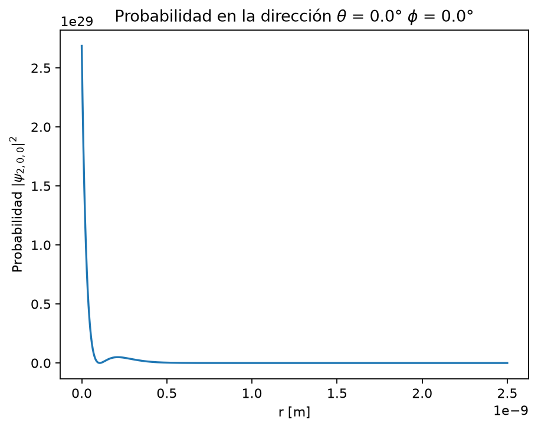
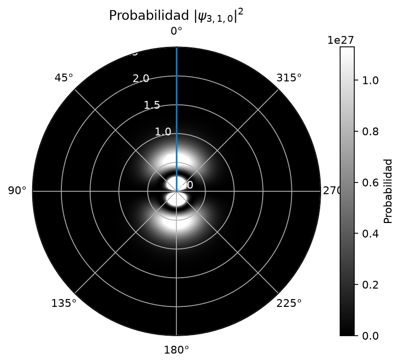
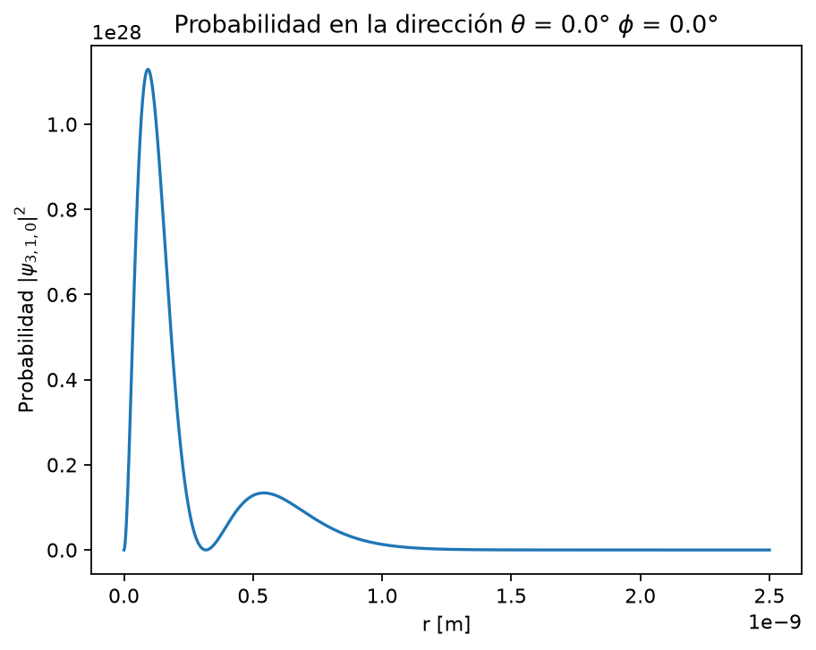
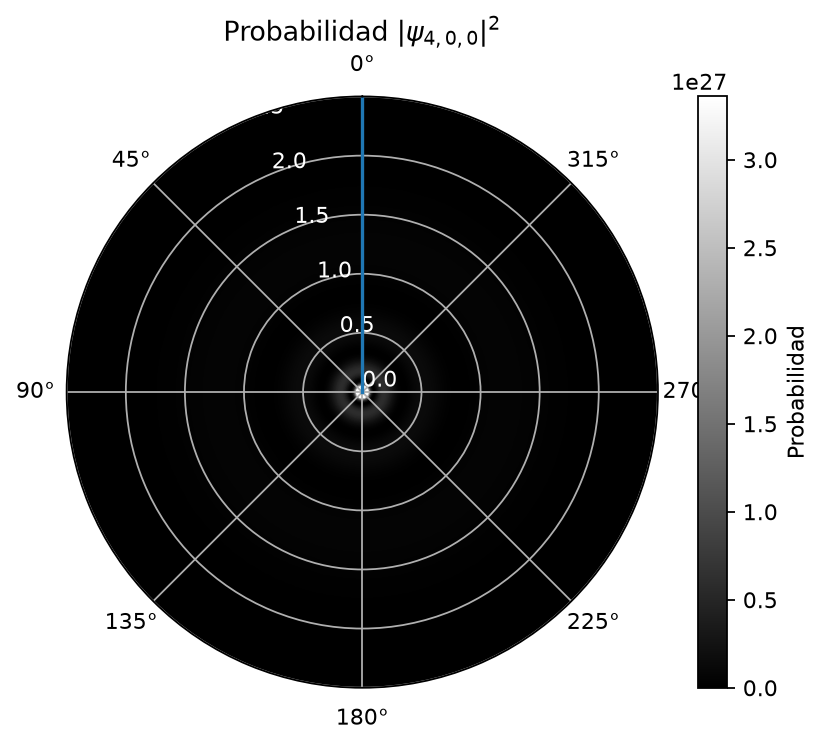
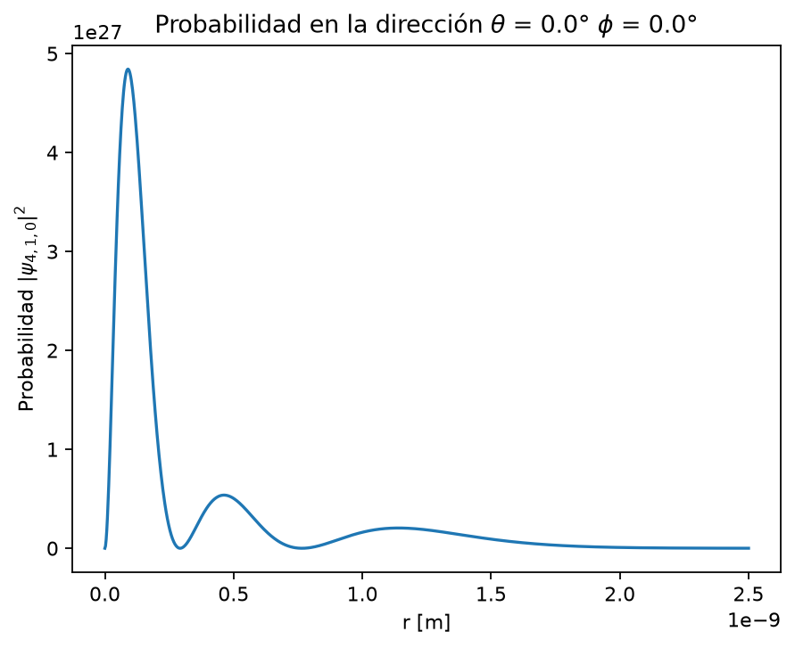
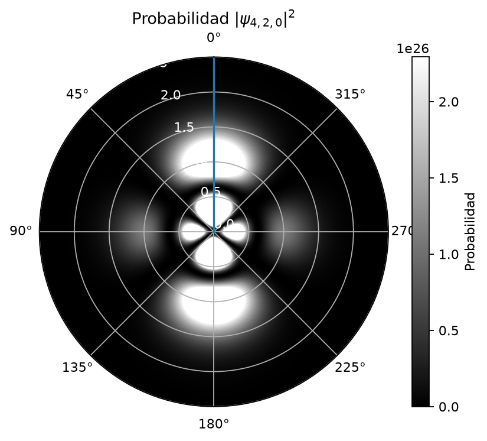
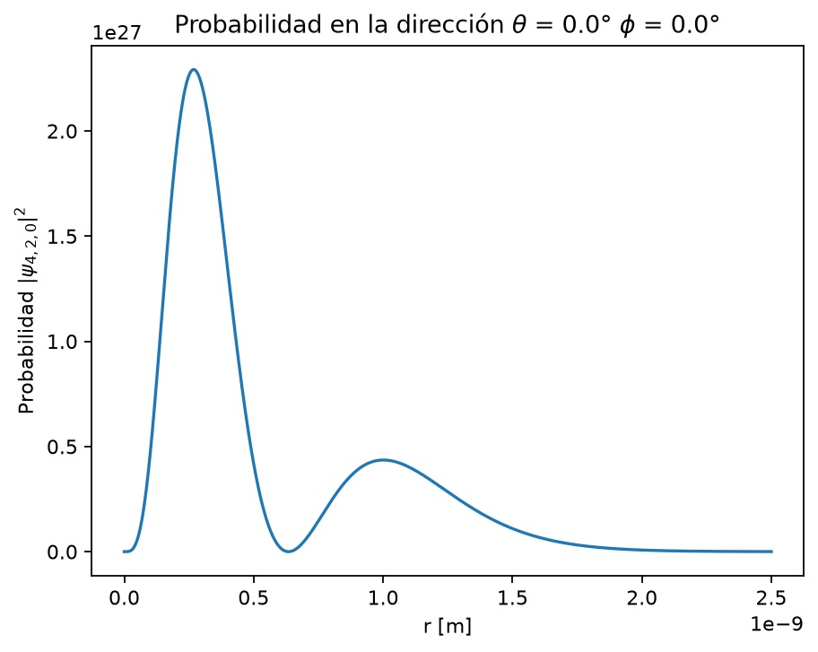
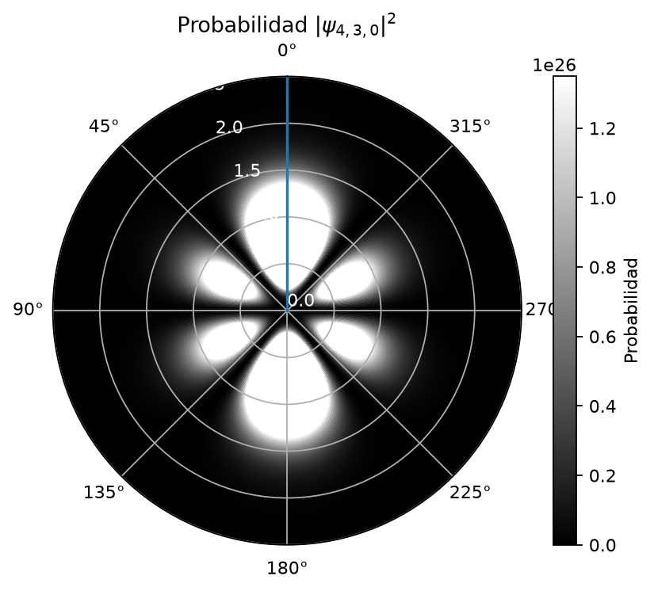
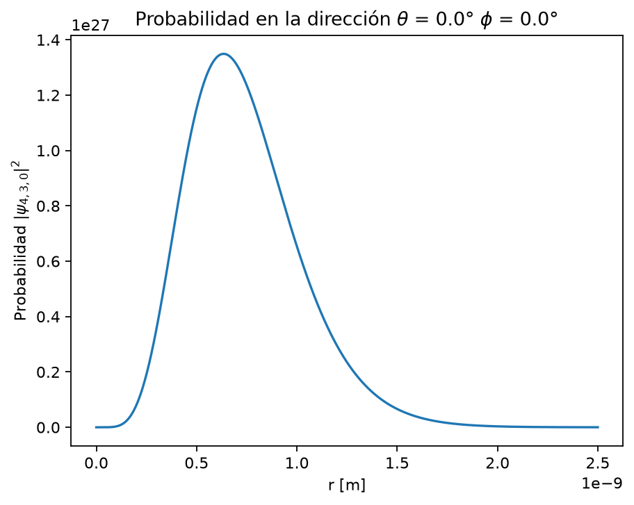

# Orbitales del átomo de hidrógeno

El átomo de hidrógeno es uno de los pocos sistemas físicos realistas que admite una solución cuántica exacta. Este proyecto calcula su función de onda y representa cortes bidimensionales de la densidad de probabilidad para distintos números cuánticos.

  

## Física del átomo de hidrógeno

Si se considera al protón fijo en el origen, el electrón está sometido al potencial atractivo de Coulomb

$$
V(r)=-\frac{e^2}{4\pi\varepsilon_0r}.
$$

Al introducir este potencial en la ecuación de Schrödinger independiente del tiempo se obtiene

$$
\left[-\frac{\hbar^2}{2m_e}\nabla^2
-\frac{e^2}{4\pi\varepsilon_0r}\right]\psi
=E\psi.
$$

Como el potencial depende únicamente de la distancia al origen, la solución se separa naturalmente en una parte radial y otra angular:

$$
\psi_{n\ell m}(r,\theta,\phi)
=R_{n\ell}(r)Y_\ell^m(\theta,\phi).
$$

Al exigir que la función sea finita y normalizable se obtiene la solución

$$
\psi_{n\ell m}
=\sqrt{\left(\frac{2}{na_0}\right)^3
\frac{(n-\ell-1)!}{2n(n+\ell)!}}
e^{-r/(na_0)}
\left(\frac{2r}{na_0}\right)^\ell
L_{n-\ell-1}^{2\ell+1}\!\left(\frac{2r}{na_0}\right)
Y_\ell^m(\theta,\phi),
$$

donde $a_0=0.529\times10^{-10}\,\mathrm{m}$ es el radio de Bohr, $Y_\ell^m$ es un armónico esférico y $L_q^p$ es un polinomio de Laguerre asociado.

Este proyecto usa la convención adoptada por Griffiths, en la que

$$
L_q(x)=\frac{e^x}{q!}
\left(\frac{d}{dx}\right)^q
\left(e^{-x}x^q\right),
\qquad L_q(0)=1,
$$

y los polinomios asociados se definen como

$$
L_q^p(x)=(-1)^p
\left(\frac{d}{dx}\right)^p
L_{p+q}(x).
$$

En la función de onda aparecen con

$$
q=n-\ell-1,
\qquad
p=2\ell+1,
\qquad
x=\frac{2r}{na_0}.
$$

Los números cuánticos permitidos y la energía son

$$
n=1,2,3,\ldots,
\qquad
\ell=0,1,\ldots,n-1,
\qquad
m=-\ell,-\ell+1,\ldots,\ell,
$$

$$
E_n=-\frac{13.6\ \mathrm{eV}}{n^2}.
$$

Finalmente, la cantidad representada por el programa es la densidad de probabilidad $|\psi_{n\ell m}|^2$. La derivación completa de la solución se encuentra en la bibliografía indicada al final.

## Estados representados

| Estado | Nombre | Energía | Nodos radiales | Nodos angulares |
|---|---|---:|---:|---:|
| $(2,0,0)$ | $2s$ | $-3.40\,\mathrm{eV}$ | 1 | 0 |
| $(3,1,0)$ | $3p$ | $-1.51\,\mathrm{eV}$ | 1 | 1 |
| $(4,0,0)$ | $4s$ | $-0.85\,\mathrm{eV}$ | 3 | 0 |
| $(4,1,0)$ | $4p$ | $-0.85\,\mathrm{eV}$ | 2 | 1 |
| $(4,2,0)$ | $4d$ | $-0.85\,\mathrm{eV}$ | 1 | 2 |
| $(4,3,0)$ | $4f$ | $-0.85\,\mathrm{eV}$ | 0 | 3 |

Cada par de figuras fue generado por `Hidrogeno.py` con $\phi=0^\circ$, $\theta=0^\circ$ y factor de escala 10. A la izquierda aparece el corte polar de $|\psi|^2$; a la derecha, el perfil sobre la dirección seleccionada. Este último es un corte direccional de la densidad, no la distribución radial $r^2|R_{n\ell}|^2$.

### Orbital $(2,0,0)$

  
  

### Orbital $(3,1,0)$

  
  

### Orbital $(4,0,0)$

  
  

### Orbital $(4,1,0)$

  
  

### Orbital $(4,2,0)$

  
  

### Orbital $(4,3,0)$

  
  

## Bibliografía

David J. Griffiths y Darrell F. Schroeter, *Introduction to Quantum Mechanics*, tercera edición, Cambridge University Press, capítulo 4, secciones 4.1 y 4.2; páginas 143–165 del PDF consultado.
